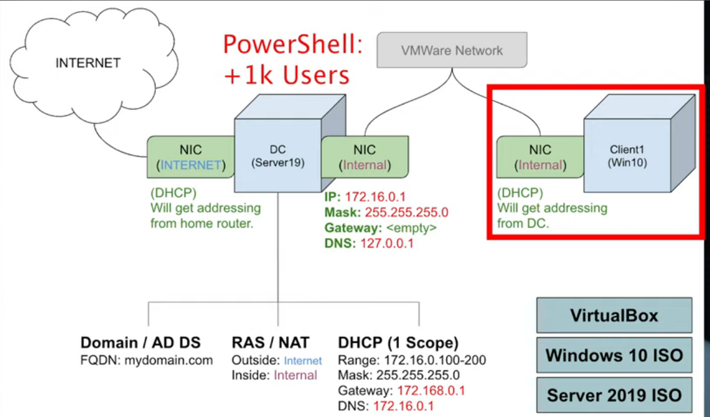
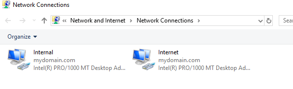
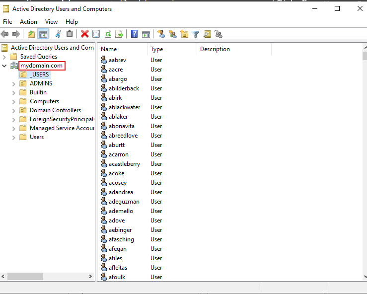
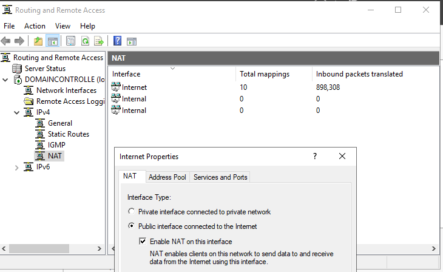
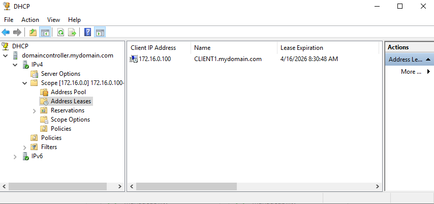
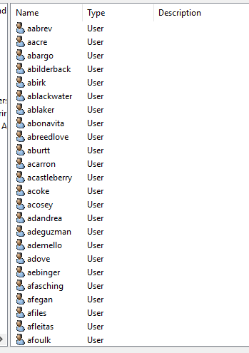
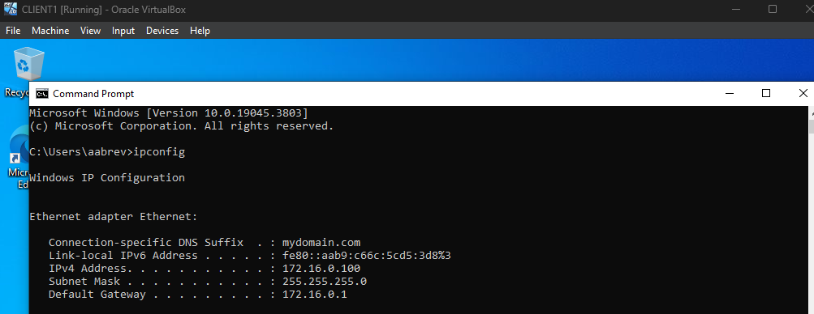
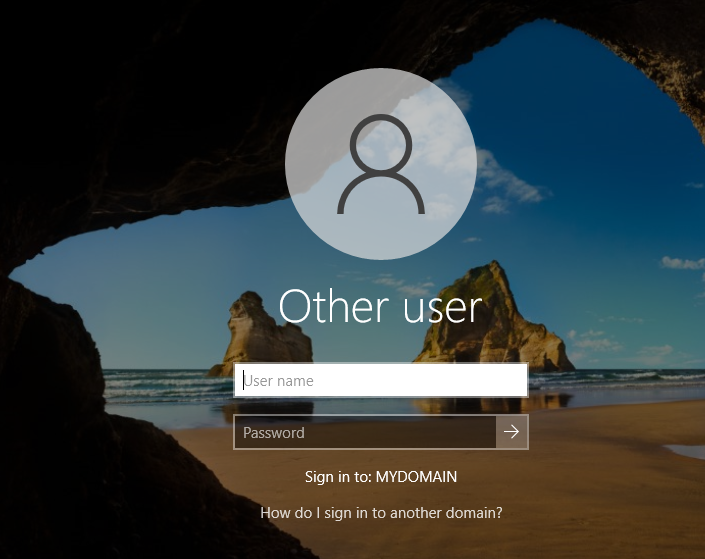

# Active Directory Home Lab Deployment (VirtualBox)

## Overview

This project involves designing and deploying a **simulated enterprise Active Directory environment** using virtualization. The lab replicates a real-world corporate network with centralized authentication, automated user provisioning, and internal network services.

### Environment Components:
- Domain Controller (Windows Server 2019)
- Client Machine (Windows 10)
- Services: DNS, DHCP, NAT, Active Directory

## Objectives

- Deploy and configure Active Directory Domain Services (AD DS)
- Understand enterprise network architecture (internal vs external networks)
- Implement centralized authentication and domain-based login
- Configure DHCP and DNS services
- Automate user provisioning using PowerShell
- Simulate real-world enterprise domain environments

## Network Architecture

### Architecture Breakdown

#### Domain Controller (DC)
- Dual NIC setup:
  - External NIC → Internet (NAT)
  - Internal NIC → Private network
- Roles:
  - Active Directory Domain Services
  - DNS Server
  - DHCP Server
  - NAT / Routing

#### Client Machine
- Connected to internal network only
- Receives IP via DHCP
- Authenticates against domain

## Implementation

### 1. Virtual Environment Setup

- Installed Oracle VirtualBox
- Created:
  - Windows Server 2019 VM (DC)
  - Windows 10 VM (Client)
- Enabled Guest Additions for better performance

### 2. Domain Controller Configuration

#### Network Configuration

- Configured two NICs:
  - Internet NIC → DHCP (auto)
  - Internal NIC → Static:
    - IP: `172.16.0.1`
    - Subnet: `255.255.255.0`
    - DNS: `127.0.0.1`

### 3. Active Directory Deployment

- Installed Active Directory Domain Services (AD DS)
- Promoted server to Domain Controller
- Created domain: mydomain.com
- Created:
  - Organizational Units (OUs)
  - Domain Admin account

### 4. NAT & Routing Configuration

- Installed Remote Access role
- Configured NAT to allow internal clients internet access

### 5. DHCP Configuration

- Configured DHCP scope:
  - Range: `172.16.0.100 – 172.16.0.200`
  - Gateway: `172.16.0.1`
  - DNS: `172.16.0.1`

- Authorized DHCP server

### 6. Automated User Provisioning (PowerShell)

- Created 1000+ users using PowerShell script

#### Key Functionality:
- Reads names from file
- Generates usernames
- Assigns password
- Creates users in AD

### 7. Client Machine Configuration

- Installed Windows 10 VM
- Connected to internal network
- Verified configuration: iconfig

### 8. Domain Join & Authentication

- Renamed machine: CLIENT1
- Joined domain: mydomain.com
- Logged in using domain account

## Validation & Testing

-  DHCP lease assigned correctly  
-  DNS resolution working  
-  Internet access via NAT  
-  Domain join successful  
-  Domain login successful  
-  Users visible in Active Directory  

## Security & Operational Insights

- Centralized authentication improves security and management
- DNS is critical for domain functionality
- DHCP misconfiguration can break connectivity
- NAT allows secure internal network isolation
- Weak password practices pose risks

## Challenges & Troubleshooting

- Missing default gateway due to DHCP misconfiguration
- Required manual DHCP correction and renewal
- PowerShell execution policy restrictions
- Multiple VM restarts required

## Lessons Learned

- AD environments depend heavily on correct networking
- DNS + DHCP + AD must work together

## Future Improvements

- Implement Group Policy Objects (GPOs)
- Enforce password policies
- Add SIEM integration (e.g., logging/monitoring)
- Simulate attack scenarios
- Expand network with more clients

## Conclusion

This lab demonstrates deployment of a **functional enterprise Active Directory environment**, including identity management, networking, and domain-based authentication. It helped me to understand how Active Directory enables workplaces to manage users and grant permissions and control access..

